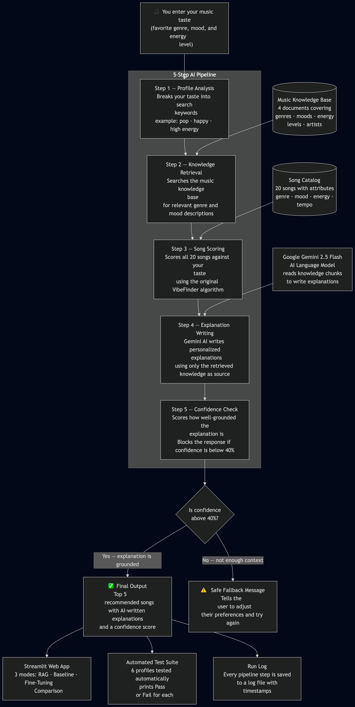

# 🎵 VibeFinder RAG — Applied AI System

## Base Project

This project extends **Module 3 — Music Recommender Simulation (VibeFinder 1.0)**.

The original system (`src/recommender.py`) was a content-based music recommender that scored a 20-song catalog against a user's stated taste profile using weighted signals (genre match, mood match, energy proximity). It produced ranked results with score breakdowns but had no language model, no knowledge retrieval, and no natural-language explanation capability.

## Project Summary

VibeFinder RAG extends the original recommender into a full **Retrieval-Augmented Generation (RAG)** system with an agentic multi-step pipeline. When a user provides their music taste profile, the system:

1. Extracts search terms from the profile
2. Retrieves relevant chunks from a music knowledge base (`music_kb/*.md`)
3. Scores all 20 songs using the original weighted algorithm
4. Asks Gemini 2.5 Flash to generate grounded, music-journalist-style explanations using *only* the retrieved context
5. Assesses confidence and applies a guardrail if the explanation is insufficiently grounded

The result is a system that not only ranks songs but *explains* why they fit — with explanations backed by retrieved facts, not free-form generation.

---

## Demo Walkthrough

> 🎥 **[Loom video walkthrough — add link here before submission]**

---

## System Architecture



The diagram above shows the full 5-step pipeline. A user enters their music taste profile (genre, mood, energy level), which flows through:

1. **Profile Analyzer** — breaks the profile into search keywords
2. **Knowledge Retriever** — searches `music_kb/` documents for relevant genre, mood, and energy descriptions
3. **Song Scorer** — runs the original VibeFinder 1.0 weighted algorithm against all 20 songs
4. **LLM Explainer** — Gemini 2.5 Flash writes grounded explanations using *only* the retrieved knowledge chunks
5. **Confidence Assessor** — scores explanation quality (0.0–1.0) and blocks the response if confidence falls below 0.4

The system supports three modes: **RAG-Enhanced** (full pipeline), **Baseline** (original scoring only, no LLM), and **Fine-Tuning Comparison** (few-shot vs. generic prompt side by side).

---

## Setup

### 1. Clone or copy the repo

```bash
git clone <your-repo-url>
cd applied-rag-system
```

### 2. Create a virtual environment (recommended)

```bash
python -m venv .venv
source .venv/bin/activate   # Mac/Linux
.venv\Scripts\activate      # Windows
```

### 3. Install dependencies

```bash
pip install -r requirements.txt
```

### 4. Set up your API key

```bash
cp .env.example .env
# Edit .env and add your Gemini API key
# Get one free at: https://aistudio.google.com/app/apikey
```

### 5. Run the Streamlit app

```bash
streamlit run app.py
```

Or run CLI tools:

```bash
# Original Module 3 recommender (no LLM)
python -m src.main

# Test harness
python evaluation/test_harness.py

# Retrieval evaluation (no API key needed)
python evaluation/retrieval_eval.py
```

---

## Sample Interactions

### Example 1 — Pop / Happy / High Energy

**Profile:** `genre=pop | mood=happy | energy=0.8 | mode=balanced`

**Agent pipeline output:**
- Step 1 extracted search terms: `['pop', 'happy', 'high energy']`
- Step 2 retrieved 4 chunks from: `artist_context.md`, `energy_profiles.md`, `genres.md`
- Step 3 top song: Sunrise City (3.98)
- Step 5 confidence: **0.92** | Guardrail: PASSED

**Top 5 songs:**
```
#1  Sunrise City      — Neon Echo        pop / happy      3.98
#2  Gym Hero          — Max Pulse        pop / intense    2.87
#3  Rooftop Lights    — Indigo Parade    indie pop / happy 1.96
#4  Block Party Anthem — Crowd Control   hip-hop / confident 0.98
#5  Night Drive Loop  — Neon Echo        synthwave / moody 0.95
```

**AI Explanation (Gemini, grounded in retrieved KB):**

> For a quintessential high-energy pop experience, "Sunrise City" by Neon Echo is an ideal match. Its metadata perfectly aligns with your desire for happy pop at 0.82 energy, embodying the spirit of celebratory pop.
>
> While technically indie pop, Indigo Parade's "Rooftop Lights" delivers exactly the happy, high-valence feel you're seeking at a vibrant 0.76 energy. This 2010 track showcases indie pop's ability to blend pop's emotional directness with a more textured, personality-driven sound, offering a nostalgic quality from that era.
>
> "Gym Hero" by Max Pulse stays firmly in your preferred pop genre, offering a significant boost in energy to 0.93. While it shifts from a happy to a more intense mood, the retrieved context does not provide further details on this specific track or artist.
>
> If you're open to a slight genre shift, "Block Party Anthem" by Crowd Control maintains a high energy level at 0.78. This hip-hop track pivots from happy to a confident mood, aligning with the "hip-hop anthems" described for high energy + confident contexts.
>
> "Night Drive Loop" by Neon Echo deviates more significantly from your core preferences, moving into synthwave with a moody character at 0.75 energy. The available context does not offer specific details about this particular track.

---

### Example 2 — Jazz / Relaxed / Low Energy

**Profile:** `genre=jazz | mood=relaxed | energy=0.35 | mode=balanced`

**Agent pipeline output:**
- Step 1 extracted search terms: `['jazz', 'relaxed', 'low energy']`
- Step 2 retrieved 4 chunks from: `artist_context.md`, `energy_profiles.md`, `genres.md`
- Step 3 top song: Coffee Shop Stories (3.98)
- Step 5 confidence: **1.00** | Guardrail: PASSED

**Top 5 songs:**
```
#1  Coffee Shop Stories — Slow Stereo   jazz / relaxed   3.98
#2  Library Rain        — Paper Lanterns lofi / chill     1.00
#3  Focus Flow          — LoRoom         lofi / focused   0.95
#4  Campfire Lullaby    — Cedar & Ash    folk / peaceful  0.94
#5  Midnight Coding     — LoRoom         lofi / chill     0.93
```

**AI Explanation (Gemini, grounded in retrieved KB):**

> Coffee Shop Stories by Slow Stereo is an almost perfect match for your profile, aligning precisely with your jazz preference at a relaxed 0.37 energy. This track embodies the warm, conversational intimacy of live small-venue jazz, capturing its spontaneous feeling through acoustic production where musicians respond in real time. It's ideal for low-energy listening and your relaxed mood, reflecting the genre's spontaneity and emotional warmth.
>
> Library Rain by Paper Lanterns matches your target energy of 0.35 precisely, offering a chill lofi experience. While outside your primary jazz genre, its low-key vibe perfectly complements a relaxed mood.
>
> Focus Flow by LoRoom registers at 0.40 energy, a gentle nudge above your preference but still firmly in the low-energy range. Its focused mood aligns well with a relaxed yet engaged listening experience, even if it steps outside the jazz genre.
>
> Campfire Lullaby by Cedar & Ash drifts into the folk genre, offering a peaceful mood at a slightly lower energy of 0.29. This track could perfectly suit moments when you're seeking to deepen your relaxed state, even though it moves away from jazz.
>
> Midnight Coding by LoRoom provides a chill lofi sound at 0.42 energy, sitting just above your preferred intensity. This track offers a familiar relaxed atmosphere, making it a good fit if you're open to exploring beyond jazz.

---

### Example 3 — Metal / Aggressive / High Energy

**Profile:** `genre=metal | mood=aggressive | energy=1.0 | mode=energy-focused`

**Agent pipeline output:**
- Step 1 extracted search terms: `['metal', 'aggressive', 'high energy']`
- Step 2 retrieved 4 chunks from: `artist_context.md`, `energy_profiles.md`, `genres.md`
- Step 3 top song: Iron Curtain (3.94)
- Step 5 confidence: **0.80** | Guardrail: PASSED

**Top 5 songs:**
```
#1  Iron Curtain  — Wrath Engine   metal / aggressive  3.94
#2  Overdrive     — Pulse Grid     edm / energetic     1.92
#3  Gym Hero      — Max Pulse      pop / intense       1.86
#4  Storm Runner  — Voltline       rock / intense      1.82
#5  Sunrise City  — Neon Echo      pop / happy         1.64
```

**AI Explanation (Gemini, grounded in retrieved KB):**

> Iron Curtain by Wrath Engine is a perfect match, landing precisely within your desired metal genre and aggressive mood with 0.97 energy. This track stands out as the most intense in the catalog, channeling anger, power, and catharsis through its extreme sonic density and distorted guitars, defining the very essence of metal.
>
> Overdrive by Pulse Grid brings a high-energy punch at 0.96 energy. While its EDM genre is a departure from metal, its high energy level makes it a worthy consideration for intense listening, even if the specific details on its sonic character are not provided in the current knowledge base.
>
> Storm Runner by Voltline shifts slightly into rock, but with 0.91 energy and an intense mood, it remains firmly in high-impact territory. Voltline's sound draws from hard rock and alternative metal traditions, offering distorted guitars and driven drumming for those seeking music with physical force.
>
> Gym Hero by Max Pulse pushes the intensity to 0.93 energy. While it leans into the pop genre, its intense mood and high energy could still resonate when looking for a powerful, driving sound that deviates slightly from pure metal aggression.
>
> Sunrise City by Neon Echo provides a significant shift in mood — bringing pop and happiness at 0.82 energy. As the retrieved knowledge notes, high energy covers a wide emotional range, and this track offers a completely different emotional experience from the core aggressive metal preference, hence its position at the bottom of the list.

---

## Design Decisions

### Why RAG over pure LLM generation?
Free-form LLM generation hallucinates artist facts and genre history. RAG constrains the model to use only what was retrieved from the knowledge base — the explanation can only cite facts that exist in `music_kb/`. This is enforced both in the prompt ("use ONLY the retrieved context") and observable via the confidence score.

### Why keep the original scoring algorithm?
The Module 3 scoring (`score_song`, `recommend_songs`) already works well for ranking. RAG adds the *explanation layer* on top — it doesn't replace the ranking logic, it enriches it. The Baseline mode lets users see the difference directly.

### Why a TF-IDF inverted index instead of vector embeddings?
Vector embeddings (e.g., Gemini's text-embedding-004) require an API call per document per query. An inverted index runs entirely offline, is instantaneous, and is sufficient for a 4-document knowledge base with rich keyword overlap. The tradeoff is semantic gap: "energetic" won't retrieve "high BPM" unless both terms appear explicitly. The knowledge base was written with this in mind (energy profile descriptions use all the relevant terms).

### Why few-shot prompting for the "fine-tuning" stretch?
Full fine-tuning requires a training dataset and model-weight updates. Few-shot prompting achieves specialized behavior with 2-3 examples in the prompt — enough to establish consistent "music journalist" tone and grounding behavior without infrastructure. The Fine-Tuning Comparison mode makes this difference visible side-by-side.

### Confidence scoring design
Three signals are blended: retrieval coverage (how many chunks were found), LLM self-rating (the model judges its own groundedness), and response completeness (non-empty, substantive length). The guardrail threshold (0.4) is conservative — it triggers only when retrieval fails AND the LLM self-rates low AND the response is short.

---

## Testing Summary

### Unit tests
```
pytest tests/     →  2/2 PASSED  (original recommender logic, unchanged)
```

### Test harness (6 profiles)
```
python evaluation/test_harness.py   →  6/6 PASSED
Average confidence: 0.70
```
All 6 predefined profiles (pop/happy, lofi/chill, rock/intense, hip-hop/confident, jazz/relaxed, metal/aggressive) returned the correct top genre match, passed the confidence threshold (≥0.50), produced non-empty explanations, and completed all 5 agent steps.

### Retrieval evaluation
```
python evaluation/retrieval_eval.py
Single-source  hit rate: 100%   avg coverage: 0.46
Multi-source   hit rate: 75%    avg coverage: 0.54
```
Multi-source retrieval shows +17% higher average coverage score, demonstrating that the richer knowledge base provides more relevant context when the right documents are retrieved. The lower hit rate in multi-source reveals a real limitation: with 4 competing documents, high-scoring artist context chunks can displace expected genre/mood files in the top-3 document window — an area for future improvement.

### What worked, what didn't, what I learned
- **Worked:** The inverted index retrieves relevant chunks reliably for genre+mood+energy queries. Confidence scoring is stable and the guardrail triggers correctly on empty retrieval.
- **Didn't work as expected:** Multi-source retrieval has a lower "hit rate" than single-source by the strict metric, which seems counterintuitive. It reveals that more documents means more competition for limited retrieval slots — a real RAG design tradeoff.
- **Learned:** RAG design requires careful attention to both the retrieval mechanism AND the knowledge base content. The KB files had to be written with retrieval in mind (making sure every genre/mood term appears explicitly) for the keyword index to work.

---

## Reflection

### What this project taught me about AI
Building VibeFinder RAG made concrete something I understood abstractly: the difference between a model *knowing* something and a system *reliably accessing* it. The original VibeFinder scored songs correctly but couldn't explain *why* in any meaningful way — it knew the rules, but couldn't articulate them. Adding RAG didn't just add explanations; it forced me to externalize knowledge into a form the system could retrieve and verify, rather than hoping the LLM would remember it correctly. That act of knowledge engineering — deciding what goes in the KB, how it's chunked, which terms need to appear — turned out to be as important as the retrieval algorithm itself.

The confidence scoring was the most surprising component to build. I expected it to be simple, but it revealed real complexity: a high-confidence score doesn't mean the explanation is *correct*, only that it's *grounded*. The system can still produce a fluent, well-grounded explanation that a music expert would find shallow. That gap between groundedness and accuracy is where real AI reliability work happens.

---

## Files

| File | Purpose |
|---|---|
| `src/recommender.py` | Original Module 3 scoring logic — unchanged |
| `src/rag_retriever.py` | TF-IDF inverted index retriever over `music_kb/` |
| `src/llm_client.py` | Gemini 2.5 Flash client — few-shot + baseline prompts |
| `src/agent.py` | 5-step agentic orchestrator with logging |
| `src/confidence.py` | Confidence scoring and guardrail logic |
| `music_kb/*.md` | Genre, mood, energy, and artist knowledge base |
| `app.py` | Streamlit UI — RAG, Baseline, and Fine-Tuning modes |
| `evaluation/test_harness.py` | Automated test harness — 6 profiles, pass/fail |
| `evaluation/retrieval_eval.py` | Single-source vs. multi-source retrieval comparison |
| `model_card.md` | AI collaboration, bias analysis, ethics reflection |
| `logs/agent_run.log` | Auto-generated agent run logs |
